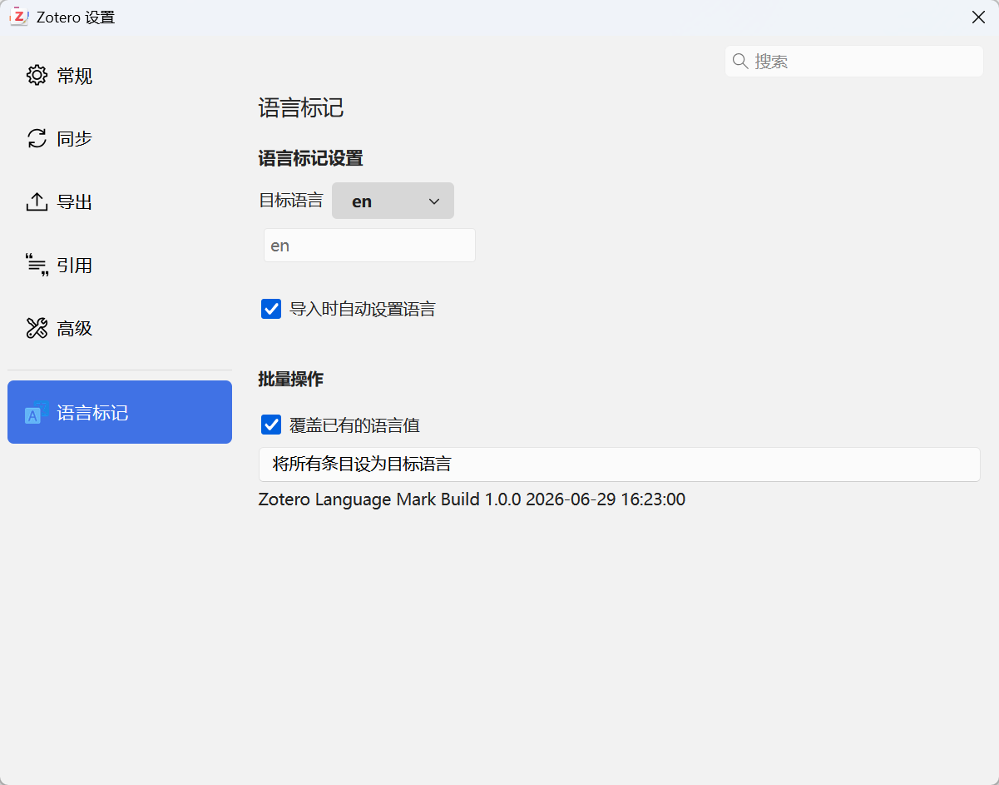

# Zotero Language Mark

[](https://www.zotero.org)

[简体中文](README.md) | [English](doc/README-enUS.md) | [Français](doc/README-frFR.md)

批量设置 Zotero 中论文条目「语言」字段的插件。

## 功能

- **选择目标语言**：提供常用语言代码预设（en、zh-CN、ja、fr、de 等），也可自定义任意语言代码
- **自动设置**：开启后，导入新论文时自动将其语言字段设为目标语言
- **批量设置**：一键将全部条目的语言字段设为目标语言
  - 默认仅修改语言字段为空的条目
  - 可勾选「覆盖已有的语言值」强制全部覆盖



## 安装与设置

### 安装

1. 从 [Releases](https://github.com/CZH-Studio/zotero-language-mark/releases) 下载最新 `.xpi` 文件
2. 在 Zotero 中，点击 `工具 → 附加组件 → 齿轮图标 → 从文件安装附加组件...`
3. 选择下载的 `.xpi` 文件并安装
4. 重启 Zotero

### 使用

1. 打开 `工具 → 附加组件`，找到 **Zotero Language Mark**，点击 `首选项`
2. 在「目标语言」下拉菜单中选择需要的语言，或选择「自定义」输入任意语言代码
3. **一键批量设置**：点击底部的按钮，将全部条目设为指定语言
4. **自动设置**：勾选「导入时自动设置语言」后，所有新导入的条目会自动标记为目标语言

### 开发

```sh
cp .env.example .env
# 编辑 .env，配置 ZOTERO_PLUGIN_ZOTERO_BIN_PATH 和 ZOTERO_PLUGIN_PROFILE_PATH
npm install
npm start
```

## License

AGPL-3.0-or-later
