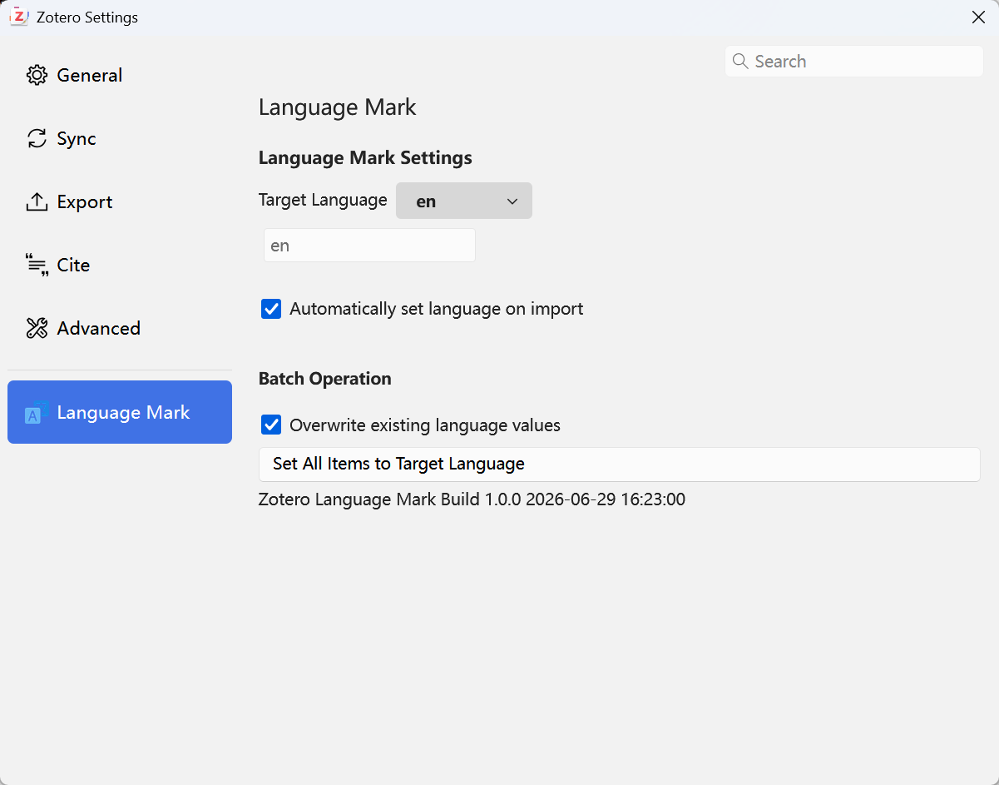

# Zotero Language Mark

[](https://www.zotero.org)

[简体中文](../README.md) | [English](./README-enUS.md) | [Français](./README-frFR.md)

A Zotero plugin for batch setting the "Language" field of items.

## Features

- **Language selection**: Choose from common language code presets (en, zh-CN, ja, fr, de, etc.) or enter a custom language code
- **Auto-set on import**: When enabled, newly imported items automatically have their language field set to the target language
- **Batch set**: Set the language field of all items in one click
  - By default, only modifies items with an empty language field
  - Check "Overwrite existing language values" to force overwrite all



## Installation & Setup

### Install

1. Download the latest `.xpi` file from [Releases](https://github.com/CZH-Studio/zotero-language-mark/releases)
2. In Zotero, go to `Tools → Add-ons → Gear icon → Install Add-on From File...`
3. Select the downloaded `.xpi` file and install
4. Restart Zotero

### Usage

1. Open `Tools → Add-ons`, find **Zotero Language Mark**, click `Preferences`
2. Choose a language from the dropdown or select "Custom..." to enter any language code
3. **Batch set**: Click the button at the bottom to set all items to the target language
4. **Auto-set**: Check "Automatically set language on import" to apply automatically to all new items

### Development

```sh
cp .env.example .env
# Edit .env to set ZOTERO_PLUGIN_ZOTERO_BIN_PATH and ZOTERO_PLUGIN_PROFILE_PATH
npm install
npm start
```

## License

AGPL-3.0-or-later
